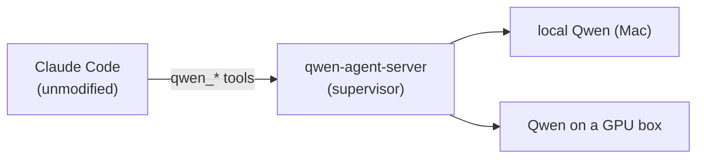

# qwen-coprocessor-stack

Run a local Qwen 3.6 as a coprocessor for Claude Code.

## What problem this solves

Claude Code is worth its tokens for the hard parts — judgment, architecture,
tricky debugging. A lot of the work it gets handed isn't that: bulk extraction,
schema-bounded JSON, OCR, embeddings and reranking, a long grinding coding task.
Paying Claude's rate for that, and burning your context window on it, is waste.
Meanwhile the Mac (and maybe a GPU box) on your desk runs a capable local model
for free.

This wires that local Qwen into Claude Code as a coprocessor. Claude stays in
charge and runs unmodified on its normal subscription; it just gains a few tools
that let it hand the cheap, bulk work to Qwen on hardware you already own.



## Why use it

You could point Claude at a raw llama-server yourself. The supervisor in the
middle is what makes a local model actually usable as a delegation target:

- It keeps each session **warm on one backend**, so the model isn't re-reading
  the whole context every turn (~98% prefix-cache hit on turn 2).
- It **routes across a mixed pool** of backends — a chat model, an embedder, a
  reranker, a remote box — from a config file, by what each can do and whether
  it's up.
- It **aborts a runaway** before an open-ended task overruns the context window
  and crashes the backend.
- It returns a **typed result** a downstream app can build against, the same
  whether the work ran on Claude or Qwen.

Any OpenAI-compatible endpoint serving a Qwen 3.6 GGUF works as a backend.

## Install

Needs Node 24+ and Claude Code on the Mac, plus at least one Qwen backend.

```bash
# Stand up a local backend (build llama.cpp + Metal, download Qwen 3.6 27B, ~25 GB).
./scripts/setup-mac-host.sh
./scripts/start-stack.sh

# Build the supervisor and install it as a Claude Code plugin.
( cd mcp-bridges/qwen-agent-server && npm install )
claude plugin marketplace add /path/to/this/repo
claude plugin install qwen-stack@qwen-stack

# Run Claude Code anywhere — the qwen_* tools are now available.
claude
```

No local GPU? Skip the first two lines and point a backend at a remote box
instead (see the User Guide). Stop the local server with `./scripts/stop-stack.sh`.

## More info

- **[User Guide](docs/USER_GUIDE.md)** — what you can hand off and how, with
  examples; adding backends; troubleshooting.
- **[Architecture](docs/ARCHITECTURE.md)** — how it works and the design choices
  worth knowing.
- **[Development & Operations](docs/DEVELOPMENT.md)** — building, testing, and the
  operational lessons.
- **[Decision records](docs/rdr/)** — the full rationale, decision by decision.
