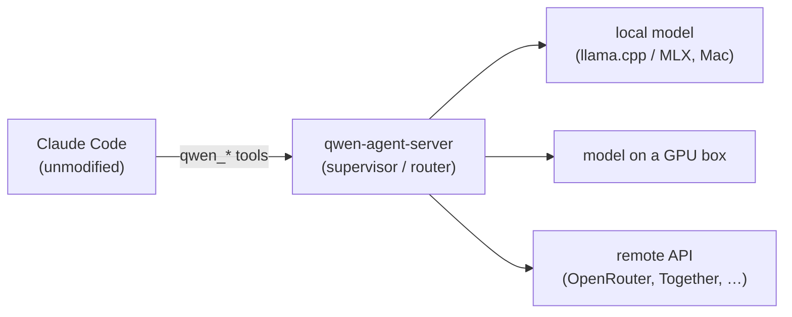

# qwen-coprocessor-stack

A small router that lets Claude Code hand cheap, bulk work to other models —
local ones on your own hardware, or remote OpenAI-compatible endpoints you
already pay for.

It is, honestly, yet another router. What it routes is the part worth caring
about: work you'd rather not pay Claude's rate for, or burn Claude's context
window on.

## What problem this solves

Claude Code is worth its tokens for the hard parts — judgment, architecture,
tricky debugging. A lot of the work it gets handed isn't that: bulk extraction,
schema-bounded JSON, OCR, embeddings and reranking, a long grinding coding task.
Paying Claude's rate for that, and spending its context window on it, is waste.

This wires a pool of cheaper models into Claude Code as coprocessors. Claude
stays in charge and runs unmodified on its normal subscription; it gains a few
`qwen_*` tools that let it delegate the cheap, bulk work to whatever backend in
the pool fits — a local model on the Mac, a model on a GPU box, or a remote API.



Any OpenAI-compatible endpoint can be a backend — llama.cpp, MLX, or a hosted
provider. Qwen 3.6 on local hardware is the default workhorse, but nothing in the
router is Qwen-specific.

## Why a router in the middle

You could point Claude at a raw endpoint yourself. The supervisor is what makes a
mixed pool of models actually usable as a delegation target:

- It keeps each stateful session **warm on one backend**, so the model isn't
  re-reading the whole context every turn (~98% prefix-cache hit on turn 2).
- It **routes across the pool** from a config file — by modality (chat / vision /
  embedding / rerank), tier (local / remote), a prompt-size capacity heuristic,
  and health — then load-balances by weighted round-robin.
- It carries **per-backend credentials** for remote authed providers
  (`api_key` / `api_key_env`, custom `headers`), so OpenRouter/Together/Fireworks
  are just more backends.
- It can hand a spawned coprocessor **exactly the tools a task needs** —
  per-spawn MCP servers and subagents, or one-flag code-intelligence
  (`codeIntel: true`, an agent-lsp symbol graph) — without a host-installed
  extension.
- It **aborts a runaway** before an open-ended task overruns the context window
  and crashes the backend.
- It returns a **typed result** a downstream app can build against, the same
  whether the work ran locally or on a remote API.

## Quick start

Needs Node 20+ and Claude Code on the Mac, plus at least one backend.

**With a local backend** (build llama.cpp + Metal, download Qwen 3.6 27B, ~25 GB):

```bash
./scripts/setup-mac-host.sh
./scripts/start-stack.sh

# Build the supervisor and install it as a Claude Code plugin.
( cd mcp-bridges/qwen-agent-server && npm install )
claude plugin marketplace add /path/to/this/repo
claude plugin install qwen-stack@qwen-stack

# Run Claude Code anywhere — the qwen_* tools are now available.
claude
```

Stop the local server with `./scripts/stop-stack.sh`.

**Remote only, no local GPU:** skip the first two lines. Add a remote backend to
`~/.qwen-coprocessor-stack/config.json` (start from
[`config/coprocessor-pool-openrouter.example.json`](config/coprocessor-pool-openrouter.example.json))
and put its key in the environment via `api_key_env`. See the
[User Guide](docs/USER_GUIDE.md#recipe-add-and-pool-backends).

Check health any time with `/qwen-stack:status`.

## The tools, briefly

Claude usually picks these for you; you just ask it to delegate.

| Shape | Tools |
|---|---|
| Stateful session | `qwen_spawn` · `qwen_poll` · `qwen_send` · `qwen_stop` · `qwen_sessions` |
| One-shot | `qwen_oneshot` (text, schema-bounded) · `qwen_oneshot_vision` (image+text) |
| Agentic dispatch | `qwen_dispatch` (one-shot repo task → typed `Artifact[]`) |
| Direct modality | `qwen_embed` · `qwen_rerank` · `qwen_tokenize` · `qwen_chat` |
| Operate | `qwen_backends` · `qwen_extensions` · `qwen_reload_extensions` |

## More info

- **[User Guide](docs/USER_GUIDE.md)** — what you can hand off and how, with
  examples; adding and pooling backends; troubleshooting.
- **[Architecture](docs/ARCHITECTURE.md)** — how the router works and the design
  choices worth knowing.
- **[Development & Operations](docs/DEVELOPMENT.md)** — building, testing,
  releasing, and the operational lessons.
- **[Decision records](docs/rdr/)** — the full rationale, decision by decision.
