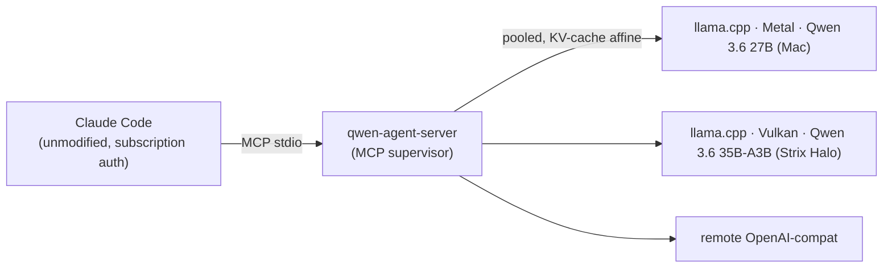

# qwen-coprocessor-stack

Locally-hosted Qwen 3.6 wired into Claude Code as an MCP coprocessor. Claude Code
runs unmodified on normal subscription auth; Qwen is exposed as a small set of
`qwen_*` MCP tools that Claude can call to hand cheap or bulk work to long-lived,
supervised inference sessions on hardware you own.



The supervisor is a TypeScript MCP server
([`mcp-bridges/qwen-agent-server`](mcp-bridges/qwen-agent-server)) on top of
[`@qwen-code/sdk`](https://www.npmjs.com/package/@qwen-code/sdk). It does the
stateful work a thin proxy would not:

- **A KV-cache-affine session pool.** Each session is pinned to one backend for
  its life, so `llama.cpp`'s prefix cache stays warm across turns (~98% hit on
  turn 2). LRU eviction and an idle reaper keep the pool bounded.
- **Config-driven multi-modal routing.** A mixed pool (chat model + embedder +
  reranker + a remote box) is declared as data; the router filters by modality,
  tier, capacity, and health, then load-balances. Add a backend by editing JSON.
- **A published cross-host dispatch contract.** Dispatch returns a typed,
  four-kind `Artifact[]` whose shape is asserted by both a TypeScript and a
  Python conformance suite, so a downstream orchestrator can build against it.
- **An evaluation harness.** A three-arm SWE-bench harness measures the
  supervisor path against the raw CLI and against Claude on a shared fairness
  spine.

Any OpenAI-compatible endpoint serving a Qwen 3.6 GGUF works as a backend. The
standard deployments are llama.cpp Metal on Apple Silicon (Qwen 3.6 27B) and
llama.cpp Vulkan on AMD Strix Halo (Qwen 3.6 35B-A3B).

## Documentation

| Doc | For |
|---|---|
| [Architecture](docs/ARCHITECTURE.md) | How it is built and why: supervisor anatomy, the router, the dispatch-contract stack, the eval harness. |
| [User Guide](docs/USER_GUIDE.md) | Task recipes: delegate work, schema-bounded extraction, vision, embeddings, pooling backends, budget tuning, integration, troubleshooting. |
| [Development & Operations](docs/DEVELOPMENT.md) | Build, test, the RDR lifecycle, the contract discipline, release process, the operations runbook. |
| [Decision records](docs/rdr/) | The design rationale. RDR-001 is the primary design doc; 007–011 are the dispatch contract. |
| [Contracts](docs/contracts/) | Published cross-host contracts and golden fixtures. |

## Requirements

- **Supervisor host (the Mac running Claude Code):** Node.js 24+, `npm`, and
  [Claude Code](https://docs.anthropic.com/claude/docs/claude-code) signed in.
  Portable; not Apple-specific.
- **At least one inference backend** (any OpenAI-compatible endpoint serving a
  Qwen 3.6 GGUF):
  - The bundled local-Mac path (`scripts/setup-mac-host.sh`,
    `scripts/start-stack.sh`) builds `llama.cpp` with Metal and runs Qwen 3.6 27B
    at `localhost:8080`. Apple Silicon, ~25 GB free disk.
  - Or a remote backend you provision separately, reached over Tailscale or any
    network you trust.

## Quick start

```bash
# 1. Build llama.cpp with Metal and download Qwen 3.6 27B (~25 GB).
./scripts/setup-mac-host.sh

# 2. Start llama-server (cold start ~5 min off external SSD, ~5 s off NVMe).
./scripts/start-stack.sh

# 3. Build the supervisor.
( cd mcp-bridges/qwen-agent-server && npm install )

# 4. Register the supervisor with Claude Code (plugin install below, or the
#    legacy ./scripts/setup-qwen-agent-server.sh path).

# 5. Run Claude Code anywhere — the qwen_* tools are available.
claude
```

Shut down the local llama-server with `./scripts/stop-stack.sh`.

## Install as a plugin

This repo doubles as a Claude Code plugin (`qwen-stack`). After `npm install` in
step 3:

```bash
claude plugin marketplace add /path/to/this/repo
claude plugin install qwen-stack@qwen-stack
# Reload from any session: /reload-plugins
```

The manifest at `.claude-plugin/plugin.json` resolves `${CLAUDE_PLUGIN_ROOT}` to
the install location, so paths stay portable.

> Migrating from the pre-0.3.0 `qwen-coprocessor-stack` plugin name:
> ```
> claude plugin uninstall qwen-coprocessor-stack
> claude plugin marketplace remove qwen-coprocessor-stack
> claude plugin marketplace add /path/to/this/repo
> claude plugin install qwen-stack@qwen-stack
> ```

## MCP tools

| Tool | Purpose |
|---|---|
| `qwen_spawn` | Start a supervised session for a task. Returns `task_id` and the chosen backend immediately; inference runs asynchronously. |
| `qwen_poll` | Read state and recent events for a session. Cursor-paginated; carries live budget counters. |
| `qwen_send` | Push the next user message into a session. |
| `qwen_stop` | Cancel and remove a session. Idempotent. |
| `qwen_sessions` | Read-only overview of pooled sessions. |
| `qwen_oneshot` | Stateless single-turn dispatch: spawn → wait → optional JSON-schema parse + retry → stop. Threads via `opts.continuation_id`. |
| `qwen_oneshot_vision` | Stateless multimodal dispatch (image+text → text). Bypasses the SDK; requires a `multimodal` backend with `--mmproj`. |
| `qwen_chat` | Direct text chat — POSTs to `/v1/chat/completions`, bypassing the agentic harness. |
| `qwen_dispatch` | One-shot agentic run against a git worktree; returns a typed `Artifact[]` (the [RDR-008](docs/rdr/RDR-008-agentic-dispatch-executor.md) executor contract). |
| `qwen_embed` | Embeddings — POSTs to `/v1/embeddings` on an `embedding` backend. |
| `qwen_rerank` | Rerank — POSTs to `/v1/rerank` on a `rerank` backend. |
| `qwen_tokenize` | Tokenize via llama-server's `/tokenize`; no generation slot consumed. |
| `qwen_backends` | List configured backends and cached health. |
| `qwen_extensions` | List installed Qwen Code extensions. |
| `qwen_reload_extensions` | Reload the installed-extensions cache. |

Full per-tool input shapes and recipes are in the [User Guide](docs/USER_GUIDE.md).

## Configuration

State lives at `~/.qwen-coprocessor-stack/config.json` (object form,
forward-extensible). A template is committed at
[`config.example.json`](config.example.json). Backends, default extensions, and
the session budget are managed by slash commands that edit the file in place and
hot-apply on the next spawn:

| Command | Purpose |
|---|---|
| `/qwen-stack:status` | One-glance overview: process state, build freshness, backend health, env overrides, red flags. |
| `/qwen-stack:backends list \| add \| remove \| test` | Backend lifecycle. |
| `/qwen-stack:extensions list \| info <name>` | List installed Qwen Code extensions. |
| `/qwen-stack:defaults list \| set <a,b,c> \| set --none \| clear` | Session-default extension list. |
| `/qwen-stack:budget list \| set […] \| clear [field]` | The session-budget caps. |

Each backend carries a `modality` (`text` default / `multimodal` / `embedding` /
`rerank`), which is the gate that makes a mixed pool auto-routable. Remote
bearer-gated backends take `api_key_env` (read at request time; the key never
lands in the file). Environment variables (`QWEN_BACKENDS`,
`QWEN_DEFAULT_EXTENSIONS`, `QWEN_MAX_CONTEXT_TOKENS`, `QWEN_MAX_TOOL_CALLS`)
override the file. Full reference: [User Guide → backends](docs/USER_GUIDE.md#recipe-add-and-pool-backends)
and the [supervisor README](mcp-bridges/qwen-agent-server/README.md#configuration).

## Session budget

The inner Qwen has no mid-flight compaction, so an open-ended task can overrun
the backend's context window and crash the HTTP layer with `ECONNRESET`. The
budget aborts cleanly first: two per-session caps (`max_context_tokens`,
`max_tool_calls`), `context_pressure` events at 50/75/90%, and a live `budget`
counter on every poll. Details and tuning in the
[User Guide](docs/USER_GUIDE.md#recipe-tune-the-session-budget).

## Downstream integrations

The stack ships the supervisor; downstream applications wire their dispatch
through it. A reference integration was designed and benched against
[nexus](https://github.com/Hellblazer/nexus) across three call-site tiers
(operator dispatch, aspect extraction, tier-B agentic tools). That integration is
parked on an exploration branch in nexus; the design and bench evidence are in
[`docs/integrations/`](docs/integrations/qwen-dispatch-nexus.md). For MCP-stdio
clients: the supervisor logs to stderr and keeps stdout clean for JSON-RPC
frames.

## Development

```bash
cd mcp-bridges/qwen-agent-server
npm run build               # tsc → dist/
npx vitest run              # unit tests (no backend required)
npm run test:integration    # integration tests (requires llama-server on :8080)
```

Build, test, the RDR lifecycle, the contract discipline, and the operations
runbook are in the [Development & Operations guide](docs/DEVELOPMENT.md).

## Repository layout

```
docs/
  ARCHITECTURE.md   USER_GUIDE.md   DEVELOPMENT.md   the composed docs
  rdr/              Decision records (RDR-001 = primary design doc)
  contracts/        Published cross-host contracts + golden fixtures
  integrations/     nexus dispatch design + bench evidence
mcp-bridges/
  qwen-agent-server/  MCP supervisor (TypeScript)
extensions/         Qwen Code extensions surface (RDR-002)
scripts/            setup / launch / keepalive / eval (see DEVELOPMENT.md)
  coding-eval/      Three-arm SWE-bench evaluation harness (Python)
models/             GGUF weights (gitignored)
```
