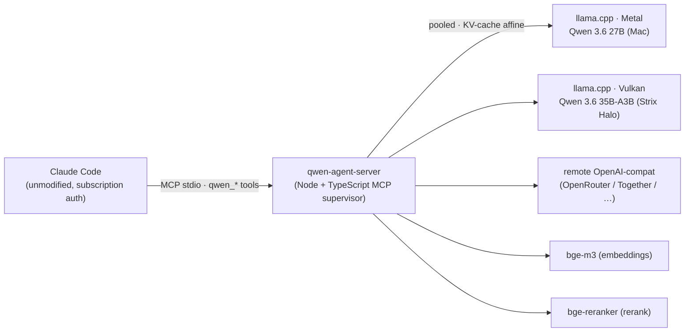
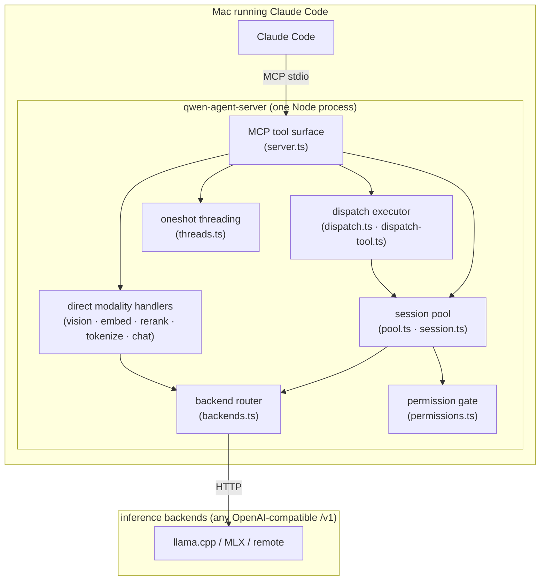
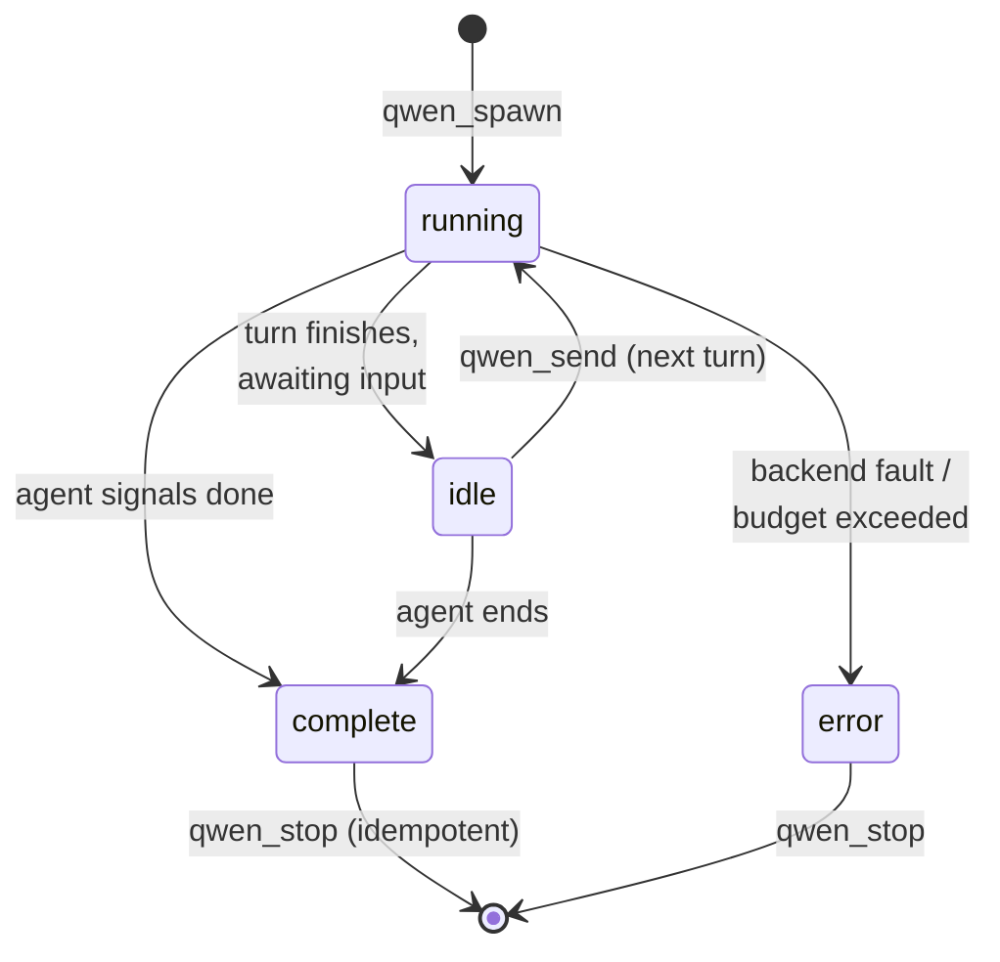
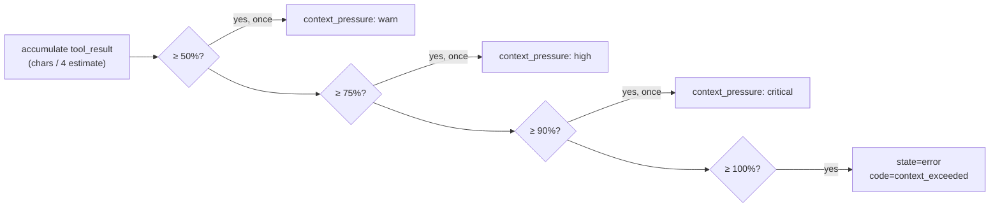
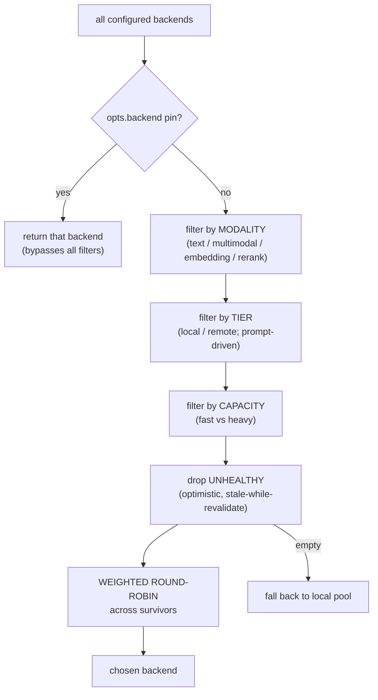
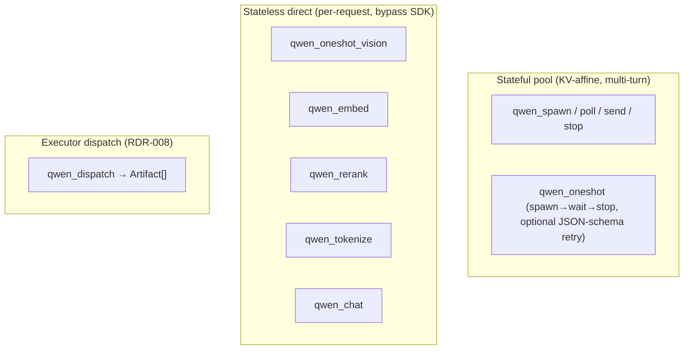
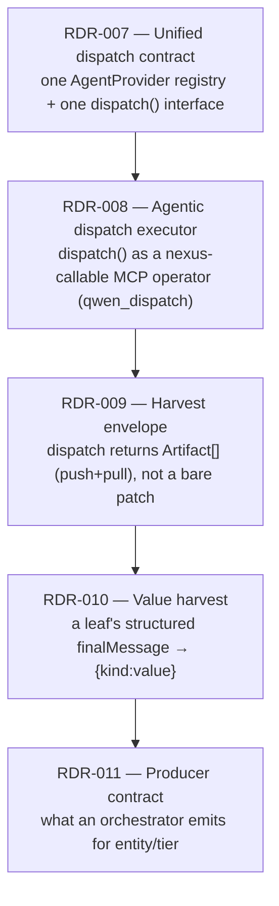
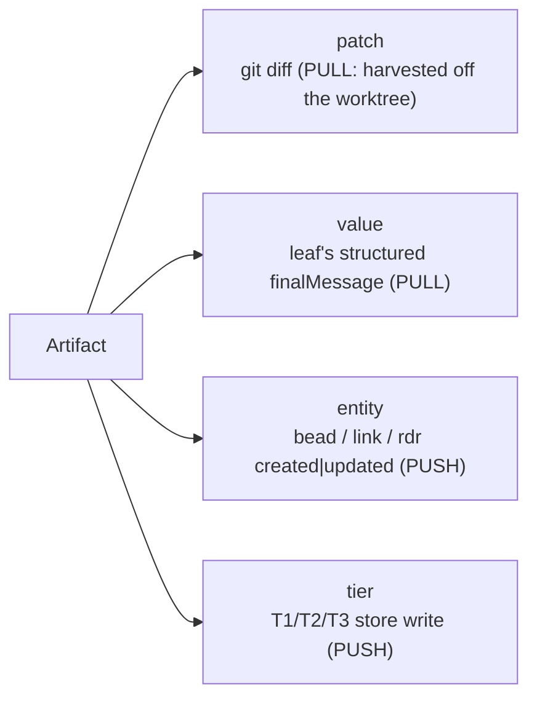
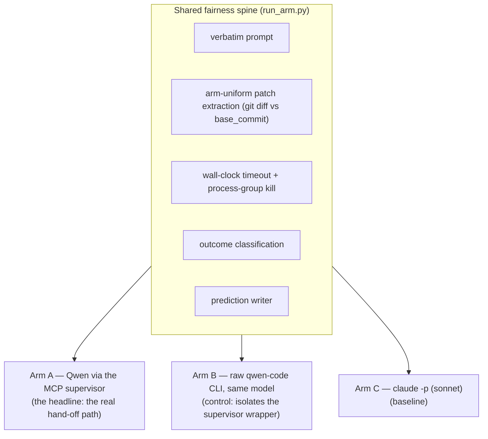
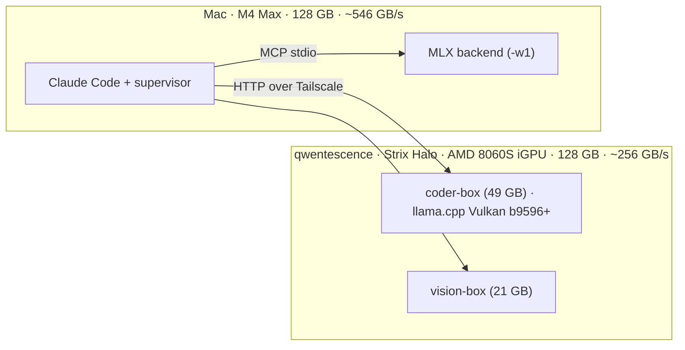

# Architecture

How the qwen-coprocessor-stack is built and why. The design records under
[`docs/rdr/`](rdr/) carry the detailed rationale; the source under
[`mcp-bridges/qwen-agent-server/src/`](../mcp-bridges/qwen-agent-server/src/) is
the ground truth. This document is the overview that ties them together.

For task recipes see the [User Guide](USER_GUIDE.md); for building, testing, and
operating it see the [Development & Operations guide](DEVELOPMENT.md).

---

## Overview

Claude Code runs unmodified, on a normal subscription. It gains a small family
of `qwen_*` MCP tools. When Claude calls one, the **supervisor** routes the work
to a locally-hosted (or remote) Qwen backend and manages everything stateful
about that delegation: which backend, how long the session lives, how the
prefix cache stays warm, what the model is allowed to do, and when to abort a
runaway.

The use case is delegating cheap or bulk work. Claude stays the orchestrator;
Qwen takes the high-volume or cost-sensitive turns (bulk extraction,
schema-bounded synthesis, OCR, a long coding run) on local hardware.

---

## What the supervisor adds

Four properties distinguish it from a thin proxy. Each is covered by a design
record.

1. **Stateful, KV-cache-affine session pool.** A `qwen_spawn` creates a
   long-lived session pinned to exactly one backend for its whole life, so
   `llama.cpp`'s prefix cache stays warm across turns (~98% prefix-cache hit on
   turn 2 within a session). Sessions are reaped by LRU and idle timeout.
   ([RDR-001](rdr/RDR-001-qwen-coprocessor-mcp-server.md))

2. **Config-driven multi-modal, multi-backend routing.** A mixed pool (a chat
   model + an embedder + a reranker + a remote heavy box over Tailscale) is
   declared as pure data in one config file. `chooseBackend` filters by
   modality, tier, capacity, and health, then load-balances. Add a backend by
   editing JSON; the supervisor hot-applies on the next spawn.

3. **A published cross-host dispatch contract.** Dispatch returns a typed,
   four-kind `Artifact[]` whose shape is asserted *byte-identically* by both a
   TypeScript and a Python conformance suite, so a downstream orchestrator
   (e.g. [nexus](https://github.com/Hellblazer/nexus)) can build against it.
   ([RDR-007](rdr/RDR-007-unified-agent-dispatch-contract.md)
   → [RDR-011](rdr/RDR-011-entity-tier-producer-contract.md))

4. **An evaluation harness.** A three-arm SWE-bench harness measures the
   supervisor path against the raw CLI and against Claude, with a shared
   fairness spine and the methodology invariants built in.
   ([RDR-006](rdr/RDR-006-coding-agent-eval.md))

---

## Component map

The node labels are the source files; read them for the detail. The rest of this
document covers the three parts worth understanding before you do: the session
pool, the router, and the dispatch contract.

---

## The session lifecycle

A pooled session (`qwen_spawn` → `qwen_poll` → `qwen_send` → `qwen_stop`) is a
small state machine. The supervisor never blocks on inference: `qwen_spawn`
returns a `task_id` immediately and the model runs asynchronously; the caller
polls.

The four states are exactly `running | idle | complete | error`
(`SessionState`, `types.ts`). `idle` is terminal *for a one-shot* but resumable
in a pooled multi-turn session via `qwen_send`. Clarifying questions are not a
state: the supervisor excludes `ask_user_question` from the inner Qwen's tool
surface, so a question surfaces as plain assistant text and is answered with
`qwen_send` ([RDR-001 §Q1](rdr/RDR-001-qwen-coprocessor-mcp-server.md)).

**Multi-turn input** rides a single `streamInput` async generator per session:
`qwen_send` pushes a message into a queue and wakes the generator. Messages
accumulate; the wake is just a signal, so back-to-back sends never collapse a
turn.

**KV-cache affinity.** Each `task_id` is bound to its backend at spawn and stays
there for the session's life. That is what keeps `llama.cpp`'s prefix cache warm
turn-over-turn — re-routing mid-session would cold-start the cache on a
different server every turn.

### The session budget

The inner Qwen has no automatic mid-flight compaction, so an open-ended task can
accumulate `tool_result` payload past the backend's context window and crash the
HTTP layer with `ECONNRESET`. The budget aborts cleanly first.

Two per-session caps: `max_context_tokens` (default `111000`, or
`floor(0.85 × backend.ctx_size)` when the chosen backend declares one) and
`max_tool_calls` (default `0` = unlimited). Every `qwen_poll` carries a live
`budget` counter so a poller can wind down between thresholds; the pressure
events fire once each so an event-only caller still gets early warning.
([RDR-002 §Session budget](rdr/RDR-002-extension-management.md))

---

## The backend router

`chooseBackend` (`backends.ts`) is a deterministic filter pipeline. Each stage
narrows the candidate pool; the last stage picks one.

- **Modality** is the hard gate: chat (`qwen_spawn`/`qwen_oneshot`) only
  considers `text`/`multimodal`; `qwen_oneshot_vision` requires `multimodal`;
  `qwen_embed`/`qwen_rerank` require their matching modality. Declaring modality
  correctly is what makes a mixed pool safely auto-routable.
- **Capacity** is a prompt-size heuristic (`classifyCapacity`): `heavy` if the
  estimated token count clears `ROUTER_HEAVY_THRESHOLD_TOKENS` (default 2000) or
  the prompt matches a heavy keyword (`prove`, `derive`, `architect`, `design`);
  else `fast`.
- **Health** is optimistic: an unprobed backend is treated as healthy and probed
  in the background (stale-while-revalidate), so a cold spawn never blocks on a
  health check.
- **Weighted round-robin** is the load-balancer: `weight` biases the share;
  `weight ≤ 0` is clamped to 1 so a misconfigured zero degrades to equal
  weighting rather than starving the pool.

Config is read from `~/.qwen-coprocessor-stack/config.json`, mtime-cached, and
hot-applied on the next spawn. In-flight sessions stay pinned to their original
backend — config edits affect new spawns only.

---

## Two dispatch paths

The supervisor exposes work in two distinct shapes, and the difference matters.

- **Stateful pool** — `qwen_spawn`/`qwen_poll`/`qwen_send`/`qwen_stop` and the
  convenience wrapper `qwen_oneshot`. These go through the SDK and the session
  pool; they get KV-cache affinity and the budget.
- **Stateless direct** — `qwen_oneshot_vision`, `qwen_embed`, `qwen_rerank`,
  `qwen_tokenize`, `qwen_chat`. These bypass the SDK entirely and POST
  OpenAI-compat content directly to a backend. No pool, no session, no
  KV-affinity — each call is independent. (The SDK is text-only, so vision *must*
  take the direct path.)
- **Executor dispatch** — `qwen_dispatch` runs a one-shot agentic task against a
  git worktree and returns a typed `Artifact[]`. This is the contract surface a
  downstream orchestrator calls.

---

## The dispatch contract stack

A downstream system (the canonical one is
[nexus](https://github.com/Hellblazer/nexus)) needs to dispatch an agentic task
to either Claude or Qwen and get back a uniform, typed result it can fold into
its own ledger. Five design records build that contract in layers.

The payload is a **four-kind `Artifact` union** — and exactly four, by design;
adding a fifth requires a real consumer:

The split:

- **The executor is one-shot and emits only `patch`/`value`.** It harvests the
  git diff off the worktree (PULL) and parses the leaf's final message (PULL). It
  never produces `entity`/`tier`.
- **`entity`/`tier` are orchestrator (PUSH) scope** — emitted by the deterministic
  spine that *knows* it created a bead or wrote a tier, at the time it does so.
  That producer lives in the downstream orchestrator (nexus), not here. This repo
  publishes the *contract* for it
  ([`docs/contracts/harvest-producer-contract.md`](contracts/harvest-producer-contract.md)),
  not the producer.

### Cross-host conformance tripwire

The four-kind union and the artifact shapes are pinned by a single golden
fixture, [`docs/contracts/fixtures/agent-shapes.json`](contracts/fixtures/agent-shapes.json),
asserted by **both** a TypeScript conformance suite and a Python one. If the TS
host (the supervisor) and the Python host (the eval harness / a downstream
re-implementation) ever drift on the wire shape, one of the two suites goes red.
That is the mechanism that lets two languages share one contract without a shared
schema compiler. See the [Development guide](DEVELOPMENT.md#the-contract--conformance-discipline)
for how to evolve it safely.

---

## The evaluation harness

Lives in [`scripts/coding-eval/`](../scripts/coding-eval/). It measures two
things: whether routing a coding agent through the supervisor costs anything in
resolve-rate, and how local Qwen compares to Claude. Three arms, one shared
fairness spine.

Only the *invocation flags* differ per arm; prompt, patch extraction, timeout,
and scoring are byte-identical across all three, so A−B isolates the supervisor
overhead and A/B−C measures the model gap. The harness encodes several
methodology rules — never compare numbers across harnesses, gold-validate any
subset before trusting it, `temperature=0` causes deterministic agentic loops —
documented in the [Development guide](DEVELOPMENT.md#evaluation-methodology)
and [`docs/qwen-coding-agent-eval.md`](qwen-coding-agent-eval.md).

---

## Topology in production

The reference deployment is two machines:

Both machines can host 30–120B small-active-MoE models; memory bandwidth (not
capacity) is the decode bottleneck. The box has several operational constraints:
GPU memory is load-order-sensitive, servers cannot detach from SSH, the
`qwen3_next` arch needs llama.cpp ≥ b9596. All are captured in the
[operations runbook](DEVELOPMENT.md#operations-runbook). The
[`scripts/`](../scripts/) directory holds the launchers, the keepalive
LaunchAgent, and the setup paths for both hosts.

---

## Where to go deeper

- **Decision records** — [`docs/rdr/`](rdr/). RDR-001 is the primary design doc;
  007–011 are the dispatch-contract stack.
- **Published contracts** — [`docs/contracts/`](contracts/). The executor
  contract, the producer contract, and the golden fixtures.
- **Downstream integration** — [`docs/integrations/`](integrations/). The nexus
  dispatch design and bench evidence.
- **The code** — [`mcp-bridges/qwen-agent-server/src/`](../mcp-bridges/qwen-agent-server/src/).
  Start at `server.ts` (the tool surface) and `backends.ts` (the router).
