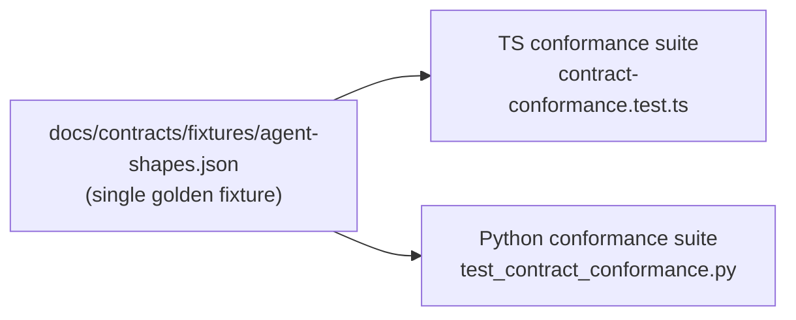

# Development & Operations

Building, testing, and running the stack. For the design picture see the
[Architecture](ARCHITECTURE.md); for usage see the [User Guide](USER_GUIDE.md).

There are two codebases: the TypeScript MCP supervisor
(`mcp-bridges/qwen-agent-server/`) and the Python evaluation harness
(`scripts/coding-eval/`). They share one cross-host contract and otherwise build
and test independently.

---

## Build and test

### Supervisor (TypeScript)

```bash
cd mcp-bridges/qwen-agent-server

npm install          # postinstall runs tsc
npm run build        # tsc → dist/ (must be clean)
npx vitest run       # unit tests; excludes tests/integration/**
npm run typecheck:tests   # type-checks the test files

npx vitest run tests/backends.test.ts   # a single suite
```

`npm run build` must be clean before anything ships. The unit suite runs with no
backend.

Integration tests (`tests/integration/`) need a live `llama-server` on `:8080`:

```bash
npm run test:integration
```

Three of them (`tests/integration/sdk-behavior.test.ts`) pin behaviours the
supervisor depends on; they must pass before any `@qwen-code/sdk` version bump.
See the [SDK pin policy](#the-sdk-pin-policy).

### Evaluation harness (Python)

The venv is gitignored; create it once:

```bash
cd scripts/coding-eval
python3 -m venv .venv
.venv/bin/pip install -r requirements-dev.txt
```

The offline gate (the suites that must pass for a contract change) is:

```bash
.venv/bin/python -m pytest \
  tests/test_contract_conformance.py \
  tests/test_run_arm.py \
  tests/test_swebench_decoupling.py -q
```

`pytest tests/ -q` is not fully offline: `tests/test_subset.py` pulls a SWE-bench
snapshot over the network. Run the rest offline with
`pytest tests/ -q --ignore=tests/test_subset.py`. A live eval needs Docker, a
served backend, and `swebench`.

### End-to-end shakeout

Against a live endpoint:

```bash
QWEN_URL=http://<host>:<port> python3 scripts/shakeout.py
```

Covers chat, JSON-schema synthesis, tool-calling, vision/OCR, tokenize, embed,
rerank. Vision tests fail on text-only models by design.

---

## Where to start in the code

The file names say what they are; the [Architecture](ARCHITECTURE.md) explains
how they fit. Two entry points:

- **Supervisor** (`mcp-bridges/qwen-agent-server/src/`): start at `server.ts` (the
  tool surface) and `backends.ts` (the router). `session.ts` is one session's
  state machine; `dispatch*.ts` is the executor contract; `types.ts` holds the
  wire types.
- **Eval harness** (`scripts/coding-eval/`): `run_arm.py` is the shared fairness
  spine; `arm_a/b/c.py` are the three drivers; `orchestrate.py` runs it all.

---

## The RDR lifecycle

Design decisions are recorded as RDRs (Research-Design-Review) under
[`docs/rdr/`](rdr/) before they are implemented. The lifecycle, driven by the
conexus plugin skills, is:

```
rdr-create → rdr-research → rdr-gate → rdr-accept → (implementation phases) → rdr-close
```

- **create** scaffolds the doc and assigns the next sequential ID.
- **research** records structured findings, verified where possible.
- **gate** runs structural, assumption-audit, and AI-critique checks; it must
  return PASSED before accept.
- **accept** marks it ready and produces a phased bead plan.
- **close** writes a post-mortem and a `§Approach`-vs-closing-beads cross-walk.

At each phase boundary, `phase-review-gate` cross-walks the RDR's numbered
`§Approach` items against their closing beads to catch silent scope reduction
before it compounds. The index of all RDRs with status is
[`docs/rdr/README.md`](rdr/README.md). RDR-001 is the primary design doc; 007–011
are the dispatch-contract stack.

### Review discipline

Non-trivial changes run two reviewers in sequence before a PR: `code-review-expert`
(correctness, security, line-level bugs) and then `substantive-critic` (unvalidated
assumptions, scope drift, spec alignment). They catch different classes of issue;
neither substitutes for the other.

---

## The contract & conformance discipline

The dispatch contract ([Architecture](ARCHITECTURE.md#the-dispatch-contract-stack))
spans two languages. The supervisor (TypeScript) produces the wire shape; the
eval harness and any downstream re-implementation (Python) consume it. There is
no shared schema compiler, so drift is caught by a golden fixture asserted on
both sides.



Both suites assert the four-kind `Artifact` union and the per-kind shapes against
this one file. To evolve the contract:

1. Change the fixture and both suites in the same commit. If only one side moves,
   the other goes red — which is the point.
2. The four-kind union (`patch | value | entity | tier`) does not grow without a
   real consumer. Adding a fifth kind is a design decision, not a refactor.
3. The executor emits only `patch`/`value`; `entity`/`tier` are orchestrator
   scope. Do not wire the entity/tier producer into the executor — that contract
   is published for the downstream host, in
   [`docs/contracts/harvest-producer-contract.md`](contracts/harvest-producer-contract.md).

The conformance suites are part of the offline gate, so a drift fails CI rather
than surfacing at integration time.

---

## Evaluation methodology

The harness encodes a set of methodology rules. Getting any of them wrong
produces numbers that look fine and are wrong.

- **Never compare numbers across harnesses.** The vendor-vs-standardized-scaffold
  gap is 10–30 points. Reproduce a known anchor in your own harness first (Claude
  Sonnet reproduced at 65% in mini-swe-agent before trusting any other number).
- **Gold-validate any subset before trusting it.** Gold patches must score ~100%;
  broken or flaky instances exist (Lite 36/40, Verified 46/50) and must be
  excluded. Build images serially — parallel cold builds throw false OOM
  failures.
- **`temperature=0` causes deterministic agentic loops** in Qwen-coder (identical
  context → identical command → step-limit, empty patch). Use the model's intended
  sampling (`temp 0.7, top_p 0.8`).
- **A too-low generation `max_tokens` truncates tool calls mid-write** →
  unparseable → stalls. Set it generously (16384) but bounded.
- **Vendor SWE-bench numbers do not reproduce in minimal harnesses.** Agentic-
  trained models are harness-robust; others are not.
- **best-of-k gains do not survive de-enrichment.** A lift measured on an enriched
  sample was a flippy-instance selection artifact, not a real selector win.

Fuller write-ups: [`docs/qwen-coding-agent-eval.md`](qwen-coding-agent-eval.md)
and [`docs/qwen-coding-agent-eval-postmortem.md`](qwen-coding-agent-eval-postmortem.md).

---

## Release process

The plugin uses a **pinned-source release model**. The marketplace entry points
at an immutable release tag; `main` can advance freely, and installed plugins
only update when a new tag is cut. Releases are hand-cut — CI runs on every push
but does not publish on merge; the tag push triggers publish.

Bumping `v<X.Y.Z>` updates these in lock-step, on a branch, in one commit:

- `pyproject.toml`, `mcpb/pyproject.toml`, `mcpb/manifest.json`
- `marketplace.json` `.metadata.version`, `.plugins[].version`,
  `.plugins[].source.ref`
- `plugin/.claude-plugin/plugin.json`
- a `CHANGELOG.md` entry

Then PR to `main`, merge, tag `v<X.Y.Z>` on the merge commit, push the tag. The
parity check `source.ref == "v" + pyproject.version` must hold. Cadence tracks
user-visible impact, not commit volume: a session of related PRs ships as one
bump. The "cut the release" instruction is always a human one.

---

## Operations runbook

The reference deployment is a Mac (M4 Max, MLX) plus a Strix Halo box
(`qwentescence`, AMD 8060S iGPU, Vulkan). Each note below is a fix for something
that broke in practice.

### Hardware

- **Box** = `qwentescence` (Windows, AMD Radeon 8060S iGPU on Ryzen AI Max+ 395;
  128 GB unified, BIOS carveout ~96 GB GPU / ~32 GB system; Vulkan sees ~106 GB;
  ~256 GB/s).
- **Mac** = M4 Max, 128 GB unified, ~546 GB/s, serves via MLX.
- Both host 30–120B small-active-MoE models; memory bandwidth (not capacity) is
  the decode bottleneck.

### llama.cpp on the box

- Use a build **≥ b9596** for the `qwen3_next` / Gated Delta Net (linear-attention)
  arch (Coder-Next). Older builds load the weights but crash the Vulkan compute on
  that arch at warmup/first-token.
- Drop `--kv-unified` (kept off since the b9090 cancel-task stall bug).

### Box GPU memory is load-order-sensitive

Vulkan has a submit-time allocation quirk: **load coder-box (49 GB) before
vision-box (21 GB)** or the second load OOMs even with nominal free memory.
Anything ≥ ~58 GB single-model tends to OOM at submit regardless.

### Box servers cannot detach from SSH

`Start-Process -WindowStyle Hidden` dies when the SSH session ends; a scheduled
task hits session-0 / GPU isolation. A keepalive holder is required.

### Keepalive (durable serving)

`scripts/ops/keepalive-coprocessor.sh` run as a launchd LaunchAgent
(`scripts/ops/com.qwen.coprocessor-keepalive.plist.example`) holds both box
servers over SSH and restarts on crash, independent of any login shell. Encoded
invariants, each a real failure:

- `ssh -n` — a backgrounded ssh reading stdin gets SIGTTIN under launchd and
  kills the daemon.
- guard every `kill` — `kill 0` signals the whole process group and self-TERMs
  into a crash loop.
- `--log-file`, not a nested shell redirect.
- order-aware recovery — if the coder anchor is down, kill all → clean GPU →
  coder → vision.

It does not survive a box reboot-while-locked (auto-login off); that needs
auto-login plus a Startup launcher or an NSSM service.

### Mac / MLX

- Serve with `-w1` for agentic runs. Two concurrent long-context (~150-turn)
  conversations plus a 42 GB model OOMs Metal and crashes the server.
- Set `HF_HOME` to an external disk so large downloads do not fill the internal
  SSD; cost is a one-time ~8-minute model load.

### Scripts

[`scripts/`](../scripts/) holds the setup, launch, and keepalive paths:

| Script | Purpose |
|---|---|
| `setup-mac-host.sh` | Build llama.cpp + Metal, download Qwen 3.6 27B. |
| `start-stack.sh` / `stop-stack.sh` | Start/stop the local Mac/Metal llama-server. |
| `setup-qwen-agent-server.sh` | Build + register the supervisor (legacy `claude mcp add` path). |
| `launch-llama-vulkan.cmd` | Windows/Vulkan launcher with tuned flags (q8_0 KV cache, 32 GB prompt cache, 128K ctx). |
| `register-llama-task.ps1` | Register the Windows scheduled task running the launcher as SYSTEM at startup. |
| `ops/keepalive-coprocessor.sh` | The launchd keepalive holder. |
| `shakeout.py` | End-to-end endpoint check. |

---

## The SDK pin policy

`@qwen-code/sdk` is pinned to an exact version (currently `0.1.7`). The three
integration tests in `tests/integration/sdk-behavior.test.ts` pin SDK behaviours
the supervisor relies on; they must pass before any version bump. The supervisor
also pins a `WRITE_TOOLS` set against that SDK version — if the SDK adds a
write-capable tool, the permission gate must learn about it. Full detail in the
[supervisor README](../mcp-bridges/qwen-agent-server/README.md#sdk-pin-policy).
