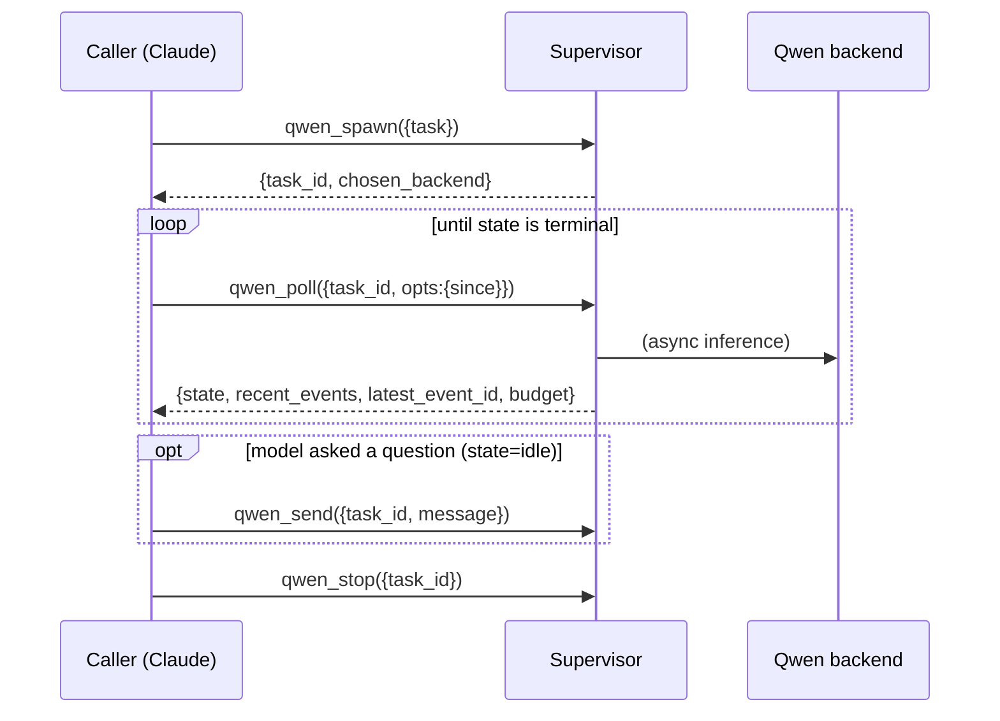

# User Guide

Task-oriented recipes for actually getting work out of the stack. If you want
the design picture first, read the [Architecture](ARCHITECTURE.md); if you want
to build, test, or operate it, see the [Development & Operations guide](DEVELOPMENT.md).

This guide assumes the stack is installed and at least one backend is healthy.
If not, start with the [Quick start](../README.md#quick-start) and confirm with
`/qwen-stack:status`.

---

## Mental model: three shapes of work

The `qwen_*` tools come in three shapes. Pick by the shape of your task, not by
habit.

| Shape | Tools | Use when |
|---|---|---|
| **Stateful session** | `qwen_spawn` · `qwen_poll` · `qwen_send` · `qwen_stop` | Multi-turn work where context should persist and the prefix cache should stay warm: a coding grind, an interactive investigation. |
| **One-shot** | `qwen_oneshot` (text) · `qwen_oneshot_vision` (image+text) | A single request/response, optionally schema-bounded. Bulk extraction, classification, OCR, synthesis. |
| **Direct modality** | `qwen_embed` · `qwen_rerank` · `qwen_tokenize` · `qwen_chat` | A specific OpenAI-compat endpoint, stateless, no agentic loop. |

In Claude Code you rarely call these by hand — you ask Claude to delegate, and
Claude picks the tool. The recipes below show the underlying call so you know
what to ask for and what comes back.

---

## Recipe: delegate a multi-turn task

Spawn returns immediately with a `task_id`; the model runs asynchronously. Poll
until terminal, answer any clarifying question with `send`, then stop.



Practical notes:

- **Poll incrementally.** Pass the previous `latest_event_id` as `opts.since` so
  each poll returns only new events.
- **`idle` is not done.** A session goes `idle` when the model finished a turn
  and is waiting for input (often a clarifying question surfaced as plain text —
  the supervisor deliberately does not give the inner Qwen an
  `ask_user_question` tool). Resume with `qwen_send`. Terminal states are
  `complete` and `error`.
- **Watch the `budget`.** Every poll carries `budget: { est_tokens, max_tokens,
  tool_calls, max_tool_calls }`. If `est_tokens` is climbing toward `max_tokens`,
  wind the task down — see [Tune the session budget](#recipe-tune-the-session-budget).
- **`qwen_stop` is idempotent.** Stopping an unknown `task_id` returns
  `{ ack: false }`, never an error.

Inspect what is live at any time with `qwen_sessions` (task_id, backend, state,
last poll, turns, live budget).

---

## Recipe: schema-bounded one-shot extraction

For bulk "read this, give me structured JSON" work, use `qwen_oneshot` with a
JSON schema. It is the drop-in for `claude -p --json-schema`-style dispatch:
spawn → wait → parse → retry on parse failure → stop, all in one call.

```jsonc
qwen_oneshot({
  task: "Extract the title, authors, and year from this paper:\n\n<text>",
  opts: {
    json_schema: {
      type: "object",
      required: ["title", "authors", "year"],
      properties: {
        title:   { type: "string" },
        authors: { type: "array", items: { type: "string" } },
        year:    { type: "integer" }
      }
    },
    max_attempts: 3
  }
})
// → { ok: true, result: "<raw>", parsed: { title, authors, year }, attempts, elapsed_ms, continuation_id }
```

- `parsed` is the validated object; `result` is the raw model text. On parse
  failure the call retries up to `max_attempts`, then returns `ok: false` with
  `error.code = "validation_failed"`.
- Markdown code fences around the JSON are stripped automatically before parsing
  (Qwen wraps JSON in ```` ```json ```` more often than it should).
- **Thread follow-ups** with `opts.continuation_id` — pass back the
  `continuation_id` from a prior call to prepend that conversation (3-hour TTL,
  20-turn cap, in-process; shared with `qwen_oneshot_vision`). If the thread has
  expired the response carries `continuation_reset: true` so you know prior
  context was lost.

---

## Recipe: vision / OCR

`qwen_oneshot_vision` is multimodal (image+text → text). It bypasses the SDK and
POSTs an OpenAI-compat content array directly to a `multimodal` backend, so it
needs a backend with the vision projector loaded (`--mmproj`).

```jsonc
qwen_oneshot_vision({
  task: "Transcribe all text in this screenshot, preserving layout.",
  images: [{ path: "/Users/me/Desktop/shot.png" }],   // or {url} or {base64, mime}
  opts: { backend: "qwentescence" }                    // optional pin
})
```

Setup and safety:

- **Enable vision on the backend.** Download the matching `mmproj-*.gguf` from
  the same HF repo as your LM weights, place it beside them, and restart
  `llama-server` with `--mmproj <path>`. The bundled launchers
  (`scripts/start-stack.sh`, `scripts/launch-llama-vulkan.cmd`) already pass the
  flag when the file is present. Verify with
  `curl http://<backend>/v1/models` → `capabilities` includes `multimodal`.
- **Image-path inputs are sandboxed.** `{path}` is `realpath`'d and rejected if
  the canonical path escapes the allowed roots (`$HOME` and the temp dir by
  default). Extend with `QWEN_VISION_IMAGE_PATHS=/extra/dir1:/extra/dir2`.
  Symlink escapes fail because realpath runs before the allowlist check.
- **URL inputs** are restricted to `http://`, `https://`, `data:`; `file:` and
  other schemes are rejected at the supervisor.
- If you pin a non-multimodal backend you get `error.code = "wrong_modality"`
  up front; if the backend lacks `--mmproj` you get `"backend_no_mmproj"` — both
  clean errors, not crashes.

---

## Recipe: embeddings, rerank, tokenize

Three direct, stateless endpoints. Each requires a backend declaring the
matching modality (except tokenize, which works against any text/multimodal
backend since the tokenizer is colocated with the model).

```jsonc
qwen_embed({ texts: ["first chunk", "second chunk"] })
// → vectors, one per input

qwen_rerank({ query: "how does routing work?", documents: ["doc a", "doc b", "doc c"] })
// → documents scored against the query

qwen_tokenize({ content: "count my tokens" })
// → { tokens, count }   (does not consume a generation slot)
```

`qwen_chat` is the text twin of vision-oneshot: a direct POST to
`/v1/chat/completions`, bypassing the agentic harness — fast and crash-free for
plain operator dispatch when you do not need tools or a session.

---

## Recipe: add and pool backends

Backends are pure config. The primary surface is
`~/.qwen-coprocessor-stack/config.json`; start from
[`config.example.json`](../config.example.json).

```jsonc
{
  "backends": [
    { "id": "local-27b",  "url": "http://localhost:8080/v1", "model": "qwen3.6-27b-instruct",
      "tier": "local",  "capacity": "fast",  "weight": 1, "ctx_size": 32768 },
    { "id": "qwentescence", "url": "http://qwentescence:1234/v1", "model": "qwen3.6-35b-a3b",
      "tier": "remote", "capacity": "heavy", "weight": 1, "ctx_size": 131072, "modality": "multimodal" },
    { "id": "embed-local", "url": "http://localhost:8081/v1", "model": "bge-m3",
      "tier": "local", "capacity": "fast", "modality": "embedding" }
  ]
}
```

Then manage it with slash commands (they edit the file in place and the
supervisor hot-applies on the next spawn — no restart):

| Command | Does |
|---|---|
| `/qwen-stack:status` | One-glance health, build freshness, env overrides, red flags. |
| `/qwen-stack:backends list \| add \| remove \| test` | Backend lifecycle + connectivity test. |
| `/qwen-stack:defaults list \| set <a,b,c> \| set --none \| clear` | Session-default extension list. |
| `/qwen-stack:budget list \| set […] \| clear [field]` | The session-budget caps. |

The one field to get right is **`modality`** (`text` / `multimodal` /
`embedding` / `rerank`). It's the gate that lets the router pick the right
backend for each kind of call, so a mixed pool stays safe. Every field is
documented inline in [`config.example.json`](../config.example.json); the ones
worth knowing:

- **`tier`** (`local` / `remote`) and **`capacity`** (`fast` / `heavy`) — the
  router classifies each task (prompt size + a few keywords) and prefers a
  matching backend, falling back to local if nothing remote is healthy.
- **`weight`** — relative share within a `tier:capacity` pool (weighted
  round-robin).
- **`roles`** — soft routing hints (e.g. `["glm"]`, `["code"]`); a caller can
  route by role instead of pinning an id.
- **Control flags**, each excluding the backend from one path: `vision_only`
  (multimodal backend kept out of the text pool — dedicated to
  `qwen_oneshot_vision`), `no_agentic` (excluded from `qwen_spawn`/`qwen_oneshot`;
  use for endpoints that choke on the agentic request shape), `no_tokenize`
  (excluded from unpinned `qwen_tokenize`), `no_schema` (excluded from
  schema-bounded oneshots).

### Remote, authed backends (RDR-012)

A backend pointed at a hosted provider (OpenRouter, Together, Fireworks) carries
credentials. Prefer **`api_key_env`** so the key is read from the environment at
request time and never sits in the file; `api_key` (a literal) is also accepted
and wins if both are set. Extra `headers` (e.g. OpenRouter's attribution
`HTTP-Referer` / `X-Title`) can be attached too.

```jsonc
{
  "id": "glm-openrouter",
  "url": "https://openrouter.ai/api/v1",
  "model": "z-ai/glm-5.2",
  "tier": "remote", "capacity": "heavy", "modality": "text",
  "roles": ["glm"],
  "api_key_env": "OPENROUTER_API_KEY",
  "headers": { "HTTP-Referer": "https://github.com/you/your-repo", "X-Title": "your-app" }
}
```

Start from [`config/coprocessor-pool-openrouter.example.json`](../config/coprocessor-pool-openrouter.example.json).
Two things to know:

- **The supervisor must be launched with the env var set** (e.g.
  `OPENROUTER_API_KEY=… ` in its environment) — `api_key_env` names the variable,
  it does not read a secrets manager. If the variable is unset, the agentic path
  sends no credential and logs `agentic_api_key_env_unset` (the provider then
  rejects the request); the direct-HTTP path just omits the header.
- **`headers` are honored on the direct-HTTP tools** (`qwen_chat`,
  `qwen_oneshot_vision`, `qwen_embed`, `qwen_rerank`, `qwen_tokenize`) but **not
  on the agentic path** (`qwen_spawn`/`qwen_oneshot`) — the `@qwen-code/sdk` has
  no request-header channel, so the supervisor warns `agentic_headers_not_forwarded`
  once per backend. OpenRouter works without them (attribution only). The
  prompt-size capacity heuristic isn't meaningful for a remote heavy endpoint —
  pin it with `opts.backend` or route by `role` rather than leaning on
  auto-capacity.

---

## Recipe: tune the session budget

If long tasks crash with `ECONNRESET`, the inner Qwen is overrunning its context
window. Cap it.

```jsonc
{
  "session_budget": {
    "max_context_tokens": 111000,   // chars/4 estimate; 0 = no cap
    "max_tool_calls": 0             // 0 = unlimited
  }
}
```

Or per call via `opts`, or via `/qwen-stack:budget set --max-context-tokens N
--max-tool-calls M`. Resolution priority: per-spawn `opts` → env → config →
`floor(0.85 × backend.ctx_size)` → hardcoded `111000`. Hitting a cap fires
`state="error"`, `error.code="context_exceeded"` with both counters in the
message. The `context_pressure` events at 50/75/90% are your cue to wind down
before that.

---

## Recipe: give a spawn its own tools and subagents (`mcpServers`, `agents`)

`qwen_spawn` / `qwen_oneshot` can hand the inner agent extra MCP servers and
subagent definitions for the life of that one spawn — no host-installed
extension. They are forwarded into the qwen-code agent via the SDK's
control-protocol `initialize`.

```jsonc
qwen_spawn({
  task: "Review the changed files and suggest fixes",
  opts: {
    backend: "glm-openrouter",
    mcpServers: {
      "lsp": { "command": "agent-lsp", "args": ["--stdio"] }   // stdio
      // or SSE:  { "url": "https://…/sse" }
      // or HTTP: { "httpUrl": "https://…", "headers": { … } }
    },
    agents: [{ name: "reviewer", description: "…", systemPrompt: "…", level: "session" }],
    allow_subagents: true
  }
})
```

Two invariants worth internalizing:

- **`agents[]` only work with `allow_subagents: true`.** Otherwise the `agent`
  tool is excluded, the definitions are dead config, and the supervisor warns
  `agents_without_allow_subagents`.
- **`mcpServers` is trusted input, not permission-gated.** A stdio server's
  `command` is spawned at SDK session init — *before* any tool call — so it is
  not governed by `write_authority` / permission mode. A read-only spawn with a
  stdio `mcpServers` entry is not actually read-only. Only pass servers you
  trust. The in-process `type: "sdk"` form is rejected at the tool boundary (it
  can't cross MCP); use stdio / SSE / HTTP.

`codeIntel: true` (next recipe) is the pre-packaged version of this for code
navigation.

---

## Recipe: give a coprocessor code intelligence (`codeIntel`)

A coprocessor doing cross-file coding work (rename a symbol, trace callers, fix a
type error) wastes turns grepping and reading whole files. Set one flag and it
gets a real language-server-backed symbol graph instead:

```jsonc
qwen_spawn({
  task: "Find every caller of chooseBackend and summarize how each uses the result",
  opts: {
    backend: "glm-openrouter",
    cwd: "/abs/path/to/repo",   // the tree agent-lsp indexes
    codeIntel: true
  }
})
```

`codeIntel: true` synthesizes three things into the spawn, server-side, before
the session starts — no per-call boilerplate:

1. an **agent-lsp** MCP server (stdio `uvx agent-lsp`) under the reserved key
   `agent-lsp`, scoped to a high-signal read-only navigation tool set
   (`start_lsp`, `list_symbols`, `find_symbol`, `find_references`, `find_callers`,
   `inspect_symbol`, `explore_symbol`, `go_to_definition`, `get_symbol_source`,
   `get_diagnostics`);
2. a **guidance block** appended to the system prompt explaining agent-lsp's
   output format (see below);
3. a **`max_tool_calls` default of 12** — applied only if you did not set one. A
   caller value always wins, including `0` (explicit "unbounded").

**The tool scope is enforced, not advisory.** agent-lsp advertises ~65 tools;
`includeTools` is applied at MCP discovery (the inner CLI never registers a tool
that is not on the list), so the model only ever sees the 10 above. This is a
hard scope, verified against the SDK and a live spawn (RDR-014 RF-4).

**Symbol-graph output, not `file:line`.** agent-lsp returns a *scored symbol
graph* — lines like `@NNN <kind> <name> SCORE lsp_resolved`, with resolved file
paths living on the graph nodes — not plain `file:line`. The injected guidance
tells the agent this and points it at the location-yielding tools
(`find_symbol` / `go_to_definition` / `get_symbol_source`) so it does not loop
trying to reformat graph output by hand. A full payload example is in
[`config/coprocessor-pool-codeintel.example.json`](../config/coprocessor-pool-codeintel.example.json).

**When to use it.** Enable for TypeScript / polyglot tasks that need cross-file
symbol navigation; leave it off for self-contained single-file edits or
non-coding work (it adds a process launch and 10 tools to the surface). Pair it
with a generous `cwd` pointing at the repo root. `max_tool_calls` 12 is a sane
default; raise it for large refactors.

**Caller-wins.** If you pass your own `agent-lsp` entry in `opts.mcpServers`, the
supervisor keeps yours untouched, logs a `codeintel_lsp_key_present` WARN, and
suppresses the guidance (it describes agent-lsp's specific tools). The
`max_tool_calls` default still applies unless you set one — the WARN says so.

**Prerequisite (not installed for you).** `uvx` (from
[uv](https://docs.astral.sh/uv/)) and `agent-lsp` must be present on the
**coprocessor host** — the supervisor does not install them. Install with
`uvx agent-lsp` (or `pip install agent-lsp`); verify the language servers it can
reach with `agent-lsp doctor` (it auto-detects typescript-language-server,
clangd, gopls, jdtls, …). If `uvx`/agent-lsp is missing, the spawn does **not**
fail at the supervisor — the supervisor does not health-probe MCP servers. The
SDK surfaces the launch failure inside the session (the `agent-lsp` tools simply
never appear and the agent reports it cannot navigate); other backends and the
rest of the spawn are unaffected. Distinguish it from a routing/credential
failure by checking that the session started and only the `mcp__agent-lsp__*`
tools are absent.

**Security surface.** `codeIntel: true` launches `uvx agent-lsp` at SDK session
init — **before any tool call, regardless of `write_authority`** (stdio
`mcpServers` commands are not permission-gated; inherited RDR-013 trust model).
Treat it as trusted input; it is not sandboxed here.

---

## Recipe: use it from your own application

The stack is the supervisor; your app wires its dispatch through it. Two patterns
(the reference is the [nexus integration](integrations/qwen-dispatch-nexus.md)):

1. **Hot path — talk to llama-server directly.** For schema-bounded oneshots and
   large-context extraction, skip the supervisor and pool entirely: POST
   OpenAI-compat to the backend's `/v1` from your own HTTP client. Lowest latency;
   you give up pooling and KV-affinity, which a stateless oneshot does not need.
2. **Agentic path — call `qwen_dispatch`.** For a one-shot agentic task that
   edits a repo, call the `qwen_dispatch` MCP operator with a `prompt` and either
   a caller-supplied `worktree` (absolute path) or a `repo` slug (the executor
   materializes a throwaway worktree), plus the `base_commit` to diff against. You
   get back a typed `Artifact[]` (`patch` / `value`) you fold into your own
   ledger. The wire shape is published and conformance-tested — see
   [`docs/contracts/qwen-dispatch-operator-contract.md`](contracts/qwen-dispatch-operator-contract.md)
   and the [Architecture](ARCHITECTURE.md#the-dispatch-contract-stack).

> **If a client speaks raw MCP stdio:** the supervisor writes logs to **stderr**
> and keeps stdout clean for JSON-RPC frames. A client that rejects non-JSON on
> stdout (the strict Python MCP SDK does) needs a supervisor build that includes
> this — every published build does.

---

## Troubleshooting

Start with `/qwen-stack:status` — it shows process state, build freshness,
per-backend health, and env overrides in one shot. The error codes are
self-describing; these are the few cases where the cause isn't obvious from the
message:

- **A session went `idle` and seems hung.** It isn't stuck — the model asked a
  clarifying question (as plain text; the inner Qwen has no question tool). Read
  the last assistant message and reply with `qwen_send`.
- **`ECONNRESET` mid-task.** The context overran and crashed the backend before
  the budget abort fired. Lower `max_context_tokens` so the clean
  `context_exceeded` abort wins, and make sure the backend declares `ctx_size`.
- **A config edit did nothing.** Either an env var is overriding the file
  (`/qwen-stack:status` flags this), or you're looking at an in-flight session —
  edits only apply to new spawns.
- **`codeIntel: true` but the agent can't navigate / no `mcp__agent-lsp__*`
  tools.** `uvx` or `agent-lsp` is missing on the coprocessor host. The spawn
  itself starts fine (the supervisor does not health-probe MCP servers); only the
  agent-lsp tools are absent. Install on that host (`uvx agent-lsp`) and verify
  with `agent-lsp doctor`. Confirm the session started and the backend is healthy
  to rule out a routing/credential issue — those fail the spawn, this does not.
